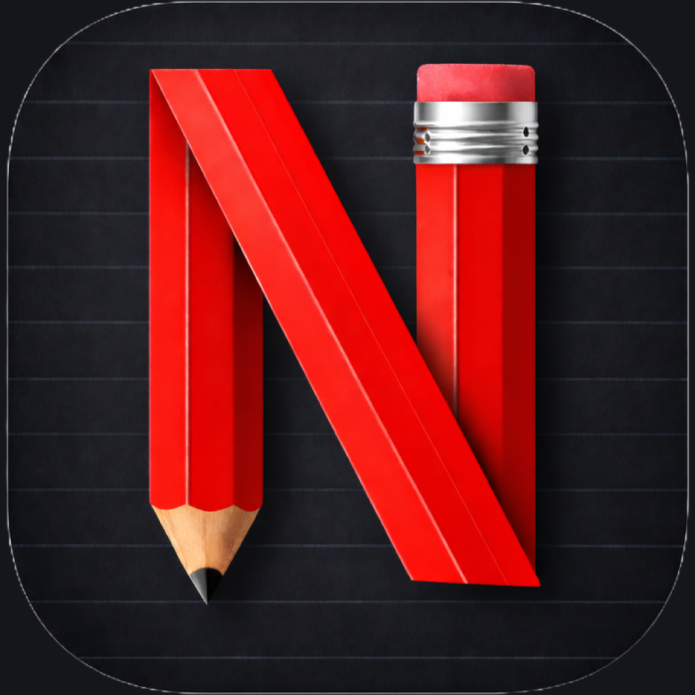

# Noteflix Study Loop



Study what you supplied—not what the model guesses.

Noteflix Study Loop is a Claude plugin for adult and higher-education learners. It turns text supplied in the current request into source-faithful guides, practice sets, one-question-at-a-time review, and realistic study plans. When the learner explicitly asks, it can connect to the learner's real Noteflix account through OAuth and save an approved result as a private note.

## What it includes

| Skill | Use it for |
|---|---|
| `organize-study-material` | Source-faithful study guides, source statements, explicit relationships, and conflict flags |
| `create-practice-set` | Flashcards, question banks, worksheets, and terminal answer keys |
| `run-quiz-first-review` | Adaptive, one-question-at-a-time active recall with session feedback |
| `build-review-plan` | Time-bounded review plans with buffers and fallback actions |
| `save-to-noteflix` | Explicitly preview, confirm, and save an artifact as a private Noteflix note |

The submitted plugin exposes one remote MCP tool: `create_private_note`. Its only data-action OAuth scope is `notes:create`; it also requests the standard `offline_access` refresh scope so a connection can renew short-lived access without repeatedly asking the learner to sign in. It cannot list, read, search, update, publish, or delete existing notes. Creating a note through Claude requires an active eligible Noteflix subscription; the server checks the subscription for the Firebase UID bound to OAuth and denies the request before any write when it cannot verify eligibility.

The connector and its OAuth flow use Noteflix's first-party endpoint at `https://noteflix.com/mcp`.

## Try it

Paste your study text into the current request, or paste the bundled [`samples/cell-biology-notes.md`](samples/cell-biology-notes.md) as a self-contained test source.

Example prompts:

1. “These lecture notes are disorganized. Turn only the text below into a concise study guide and flag anything contradictory or incomplete.”
2. “Using only this chapter excerpt, make 15 flashcards and eight direct-retrieval questions. Put every back and answer in one answer key at the end.”
3. “Quiz me on the text below one question at a time. Start broad, then focus on whatever I miss.”
4. “My exam is Friday. I have 40 minutes tonight and one hour on each of the next three days. Build a review plan from these topics and the quiz results I pasted below.”
5. “Save the study guide you just drafted to Noteflix.” Claude must show the exact private-note payload and obtain a separate confirmation before creating it.

## Private save flow

1. The learner explicitly asks to save an artifact to Noteflix.
2. Claude shows the destination, private visibility, exact title, exact Markdown content, and any optional summary or key points.
3. Claude asks “Save this as a private Noteflix note?” and waits.
4. After an affirmative reply, Claude calls `create_private_note` once with an idempotency request ID.
5. Noteflix returns the private in-app note link.

The original save request is not the confirmation. Editing the preview requires a new preview and confirmation. Ordinary study requests never trigger a save.

## Connection and permissions

The connection uses OAuth; learners never paste a Noteflix password or API key into Claude. The grant includes `notes:create` as its sole data-action scope and `offline_access` for refresh-token renewal; `offline_access` does not add permission to read or change Noteflix data. Saved notes are forced private by the integration. Disconnect the Claude connection to stop future access. Delete individual notes in Noteflix, or delete the account and its data from [Noteflix settings](https://noteflix.com/noteflix-settings).

The plugin does not inspect uploads, enumerate attachments, retrieve prior conversations, read Claude memory, query connectors, or search a Noteflix library. Study source material must be pasted or otherwise supplied as text in the current request. See [PRIVACY.md](PRIVACY.md) for retention and data-handling details.

## Media boundary

The directory-submitted plugin creates private text notes only. It does not expose or invoke any AI video, audio, image, podcast, or other media-generation tool, and saving through this integration does not start derived-media generation.

## Local installation and testing

Clone this repository and start Claude Code with the plugin directory:

```bash
git clone https://github.com/kotc-org/noteflix-study-loop.git
claude --plugin-dir ./noteflix-study-loop
```

Validate the package:

```bash
claude plugin validate --strict ./noteflix-study-loop
```

In a Claude Code session, use a natural-language prompt from above or explicitly invoke a namespaced skill, for example:

```text
/noteflix-study-loop:run-quiz-first-review
```

The four study skills require no account. Testing the save flow requires an active eligible Noteflix subscription and completes the normal Noteflix OAuth flow; no API key or environment variable is required.

## Learning boundaries

- The plugin is intended for adults and higher-education learners, not users under 18 or K–12 student deployment.
- Study outputs stay grounded in text supplied in the current request.
- The skills flag source gaps and conflicts instead of silently inventing corrections.
- The plugin provides learning support rather than direct answers to live or graded assessments.
- Session results are not a grade prediction or persistent learner profile.
- Study plans do not read or write calendars and do not guarantee outcomes.

## Review resources

- [Reviewer setup and test cases](REVIEW_CHECKLIST.md)
- [Submission metadata](SUBMISSION.md)
- [Privacy](PRIVACY.md)
- [Support](SUPPORT.md)
- [Security](SECURITY.md)
- [Changelog](CHANGELOG.md)

## License

MIT © 2026 Noteflix. The Noteflix name and logo are used with authorization of the Noteflix publisher.
