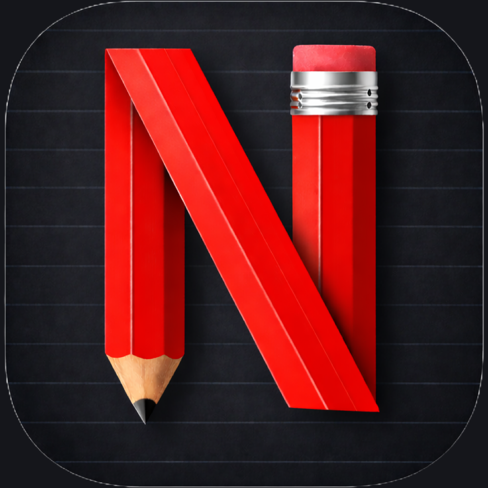

# Noteflix



Study what you supplied—not what the model guesses.

Noteflix is a universal ChatGPT and Codex plugin that combines source-faithful study skills with a narrowly scoped Noteflix account connector. It turns text supplied in the current request into guides, practice sets, one-question-at-a-time review, and realistic study plans. With explicit approval, it can save the resulting artifact as a private Noteflix note. The existing Claude plugin package remains supported.

## What it includes

| Skill | Use it for |
|---|---|
| `organize-study-material` | Source-faithful study guides, source statements, explicit relationships, and conflict flags |
| `create-practice-set` | Flashcards, question banks, worksheets, and terminal answer keys |
| `run-quiz-first-review` | Adaptive, one-question-at-a-time active recall with session feedback |
| `build-review-plan` | Time-bounded review plans with buffers and fallback actions |
| `save-to-noteflix` | Explicitly preview, confirm, and save an artifact as a private Noteflix note |

The default remote MCP server exposes one account-bound action: `create_private_note`. It cannot list, read, search, update, publish, or delete existing notes. Creating a note requires an existing eligible Noteflix account; the server checks eligibility for the exact Firebase UID bound to OAuth and fails closed when it cannot verify access. Video tools are not part of the default launch and remain optional future work.

The universal package loads the five skills from `skills/`, the first-party connector from `.mcp.json`, and the Noteflix icon from `assets/noteflix-icon.png`.

## Try it

Paste your study text into the current request, or paste the bundled [`samples/cell-biology-notes.md`](samples/cell-biology-notes.md) as a self-contained test source.

Example prompts:

1. “These lecture notes are disorganized. Turn only the text below into a concise study guide and flag anything contradictory or incomplete.”
2. “Using only this chapter excerpt, make 15 flashcards and eight direct-retrieval questions. Put every back and answer in one answer key at the end.”
3. “Quiz me on the text below one question at a time. Start broad, then focus on whatever I miss.”
4. “My exam is Friday. I have 40 minutes tonight and one hour on each of the next three days. Build a review plan from these topics and the quiz results I pasted below.”
5. “Save the study guide you just drafted to Noteflix.” The assistant must show the exact private-note payload and obtain a separate confirmation before creating it.

## Private save flow

1. The learner explicitly asks to save an artifact to Noteflix.
2. The assistant shows the destination, private visibility, exact title, exact Markdown content, and any optional summary or key points.
3. The assistant asks “Save this as a private Noteflix note?” and waits.
4. After an affirmative reply, the assistant calls `create_private_note` once with an idempotency request ID.
5. Noteflix returns the private in-app note link.

The original save request is not the confirmation. Editing the preview requires a new preview and confirmation. Ordinary study requests never trigger a save.

## Connection and permissions

The connection uses OAuth; learners never paste a Noteflix password or API key into the assistant. The default launch requests the least-privilege `notes:create` scope. `offline_access` may be requested for refresh-token renewal and does not add permission to read or change Noteflix data. Saved notes are forced private by the integration. Disconnect the connection to stop future access. Delete individual notes in Noteflix, or delete the account and its data from [Noteflix settings](https://noteflix.com/noteflix-settings).

The plugin does not inspect uploads, enumerate attachments, retrieve prior conversations, read host memory, query unrelated connectors, or search a Noteflix library. Study source material must be pasted or otherwise supplied as text in the current request. ChatGPT and Codex users can read the [public Noteflix plugin privacy policy](https://chatgpt.noteflix.com/privacy) and its [submission source copy](openai/DATA_FLOW_AND_PRIVACY.md); [PRIVACY.md](PRIVACY.md) is the separate Claude compatibility policy.

## Media boundary

Creating a private note never starts media generation. The default launch exposes no video, audio, podcast, or image-generation action. Any future optional media tools will require their own permission, disclosure, and explicit confirmation flow before release.

## ChatGPT and Codex packaging

The universal package entry point is `.codex-plugin/plugin.json`. It bundles the five study skills, the private-note MCP connector, and the registered Noteflix app mapping under the plugin identifier `noteflix`, using the directory title **Noteflix** and the **Education & Research** category. The included `.app.json` is for local ChatGPT and Codex installation; public submission uses **Create plugin → With MCP** and the production MCP URL directly.

After publication, install Noteflix from the Plugins Directory in ChatGPT or from `/plugins` in Codex CLI. Start a new conversation after installation, then use a natural-language prompt from above or invoke `@noteflix`.

## Claude compatibility

Claude Code remains supported through `.claude-plugin/plugin.json` and the same skill bundle. Clone this repository and start Claude Code with the plugin directory:

```bash
git clone https://github.com/kotc-org/noteflix-study-loop.git
claude --plugin-dir ./noteflix-study-loop
```

Validate the package:

```bash
claude plugin validate --strict ./noteflix-study-loop
```

In a Claude Code session, use a natural-language prompt from above or explicitly invoke a namespaced skill, for example:

```text
/noteflix-study-loop:run-quiz-first-review
```

The four study-only skills require no account. Testing private-note capture requires an existing eligible Noteflix account and completes the normal Noteflix OAuth flow; no API key or environment variable is required.

## Learning boundaries

- The ChatGPT and Codex listing is for general audiences age 13 and older and is not directed to children under 13. The existing Claude submission remains scoped to adult and higher-education use.
- Study outputs stay grounded in text supplied in the current request.
- The skills flag source gaps and conflicts instead of silently inventing corrections.
- The plugin provides learning support rather than direct answers to live or graded assessments.
- Session results are not a grade prediction or persistent learner profile.
- Study plans do not read or write calendars and do not guarantee outcomes.

## Review resources

- [ChatGPT and Codex submission package, reviewer setup, and test cases](openai/README.md)
- [Claude reviewer setup and test cases](REVIEW_CHECKLIST.md)
- [Claude submission metadata](SUBMISSION.md)
- [ChatGPT and Codex public privacy](https://chatgpt.noteflix.com/privacy)
- [ChatGPT and Codex public support](https://chatgpt.noteflix.com/support)
- [Claude privacy](PRIVACY.md)
- [Claude support](SUPPORT.md)
- [Claude security](SECURITY.md)
- [Changelog](CHANGELOG.md)

## License

MIT © 2026 Noteflix. The Noteflix name and logo are used with authorization of the Noteflix publisher.
